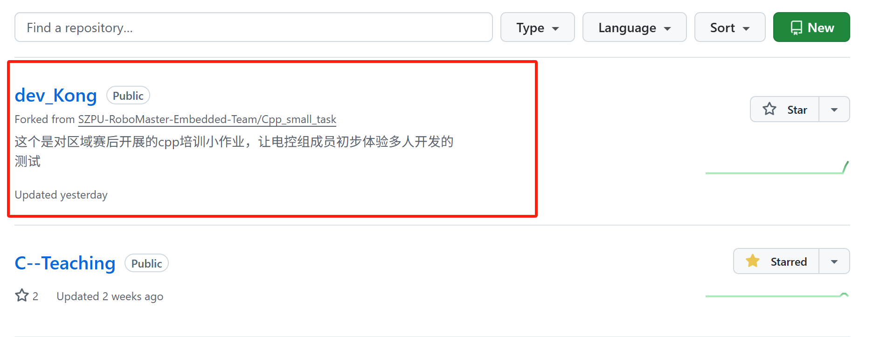
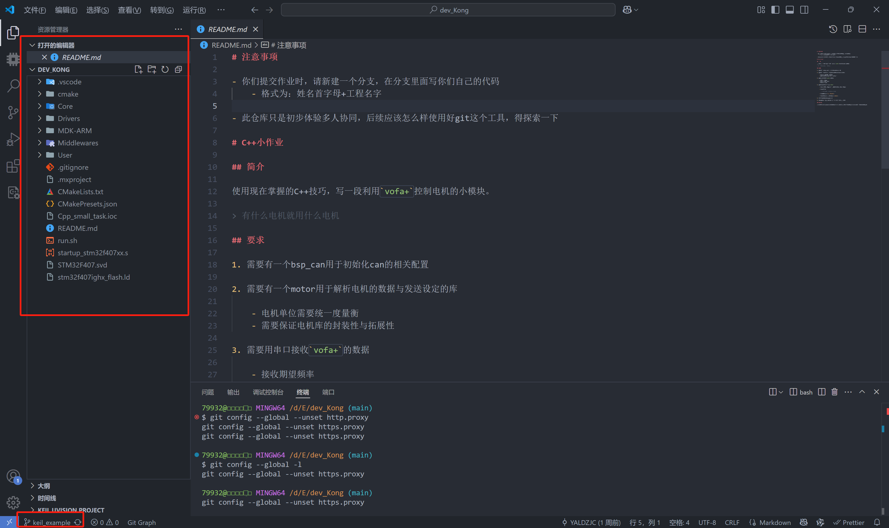
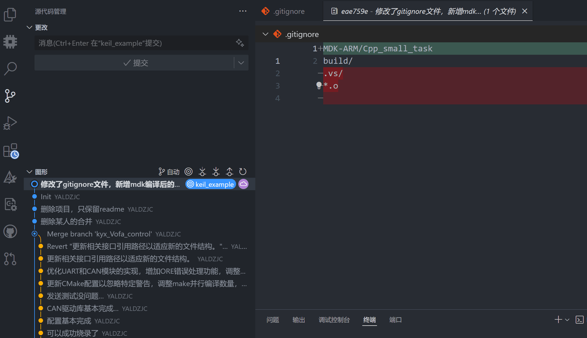

# Github如何提交一个Pull Request使用

## fork

当我们想要给一个github云端仓库做贡献时，我们首先需要将其他人的云端仓库fork(复制)到自己的云端仓库

点击fork选项，此时会跳转到如下页面。如果你想要在其他分支上开发，就取消Copy the main branch only.

> 这个选项的意思是只fork main分支

此时进入属于自己的github云端仓库，就能发现多出来了一个一模一样的仓库。

我们进入到该仓库页面，使用URL克隆到本地。

> 本教程使用vscode，如何用desktop克隆之前以及讲过

## 克隆

在vscode中新开一个窗口

依次点击如下选项

> 如果发现显示电脑没有安装git，首先要先安装一下
>
> 官网为:[Git - Downloads](https://git-scm.com/downloads)

输入复制的URL，选择存储库URL。

然后会弹出如下选项栏，确认是否为自己想要克隆的仓库。

然后选择自己想要的文件夹，克隆后的文件会出现选中的文件夹下。

如果一切正常，右下角会弹出进度条。

如果弹出如下窗口，请取消git的代理设置。

### 取消代理

打开用vscode终端打开git bash。

输入以下命令，进行设置：

~~~bash
git config --global --unset http.proxy 
git config --global --unset https.proxy
~~~

然后再输入，以下命令检查是否完成取消。

~~~bash
git config --global -l
~~~

如果完成会弹出如下窗口，直接打开就行

已经克隆完成。

## branch

为了在自己开发时不影响其他人的开发，通常会创建一个分支，在分支中进行自己的开发。测试完毕后就会提交pr合并分支。

在vscode中可以直接切换分支，方法如下

此时在换到文件目录，发现已经切换分支了。

## gitignore

如果有一些文件没必要上传至云端，那么可以设置一个`ignore`文件让git忽略上传这个文件。

> 比如代码编译后产生的文件
>
> 其中，keil5生成的编译文件在如下目录下
>
> 记得要反斜杠。下图没有反斜杠

## commit

当我们修改文件之后，我们需要提交修改的文件至本地仓库

> 文件被修改，vscode会显示黄色。
>
> 文件新建会显示绿色。
>
> 文件删除会显示红色。

此时我们修改了.gitignore文件，点击更改选项卡，会显示我们修改了什么地方

此时点击提交，代码就提交到了本地仓库。

**如果想要再上传至云端，还需要点击同步更改**

同步更改后，我们的代码就推送到自己的云端仓库了。

## 在vscode中创建PR

当我们想要让fork中的提交同步到别人的仓库，就要使用pr(Pull Request)了。

### 下载Github Pull Request插件

原生的vscode并不能一键生成pr请求，所以需要下载插件。

## 申请PR

点击插件新增的生成选项，将想要合并的分支选好，就可以直接生成了，成功做到了vscode一站式服务。

如果使用desktop也可以在分支中选择。

****

## 同意PR

此时，在仓库所有者那一边，会出现一个pr请求，如果文件无冲突就可以直接合并了。

### 三种PR类型

同意pr的时候会出现三种可以选择的类型。

| 类型             | Create a merge commit          | Squash and merge                         | Rebase and merge                  |
| ---------------- | ------------------------------ | ---------------------------------------- | --------------------------------- |
| **提交历史保留** | 保留所有原始 commit + 合并节点 | 仅保留 1 个新 commit，丢弃原 commit 细节 | 保留所有原始 commit，但历史线性化 |
| **分支结构**     | 树状（有合并节点）             | 线性                                     | 线性                              |
| **适用场景**     | 需完整追溯开发过程             | 简化历史，隐藏开发细节                   | 追求线性历史，且 commit 规范      |

当开发者点击之后，PR就成功的合并到了分支中。